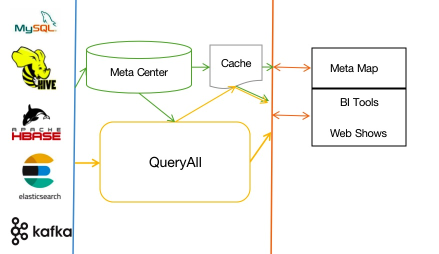

一.背景

    目前数据都分散在不通的环境，如mysql、MongoDB，ElasticSearch, Hbase，或者消息数据Kafka, 数据仓库Hive等。
    通常是通过不通的接口或者查询引擎，到指定的DB做对应的数据查询，或者将分散的数据通过ETL整合到统一存储，如Hive做数仓。
    但是ETL的过程需要时间，少则是小时级别，多则是T+1才能够统一整合，然后进行数据加工或者分析。
    QueryAll是想做到anydata, anytime, anywhere
        1. 离线，实时数据查询支持；
        2. 通过标准sql，统一查询引擎，不用进行引擎切换，可以查询所有的数据存储类型；
        3. 不同存储的数据可以做join,比如mysql和ElasticSearch，或者mysql和kafka的数据做join；
        
二.实现
   
   1. 绿色流向是元数据，创建全局的元数据中心，元数据管理和权限管理，是Meta Map
   2. 黄色是数量流向，用户通过输入的标准sql，通过元数据中心能够适配为执行引擎对应的表和返回对应的数据结果集展示或者报表展示      

三.
   1.访问在线库是访问存库，也考虑限制连接数
   2.查询数据量做限制，例如必须带分区，避免全表扫描
   3.meta center 做表记录列级别，行级别权限管控，对敏感度高的字段需要申请权限才可以查询
   4.查询结果或者报表结果缓存，如果是5小时之内的建议用户不用重新查询，也可以手动触发执行新的查询结果
   